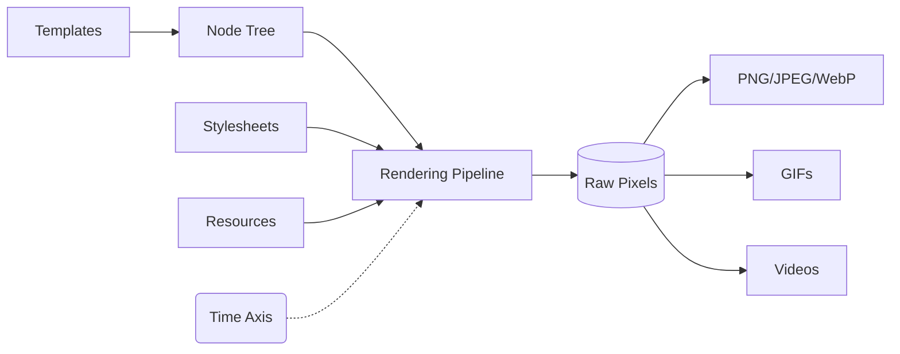
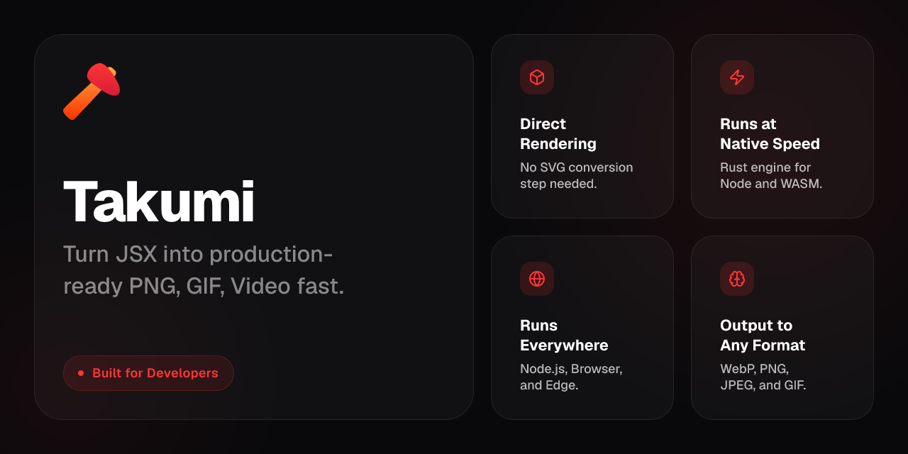
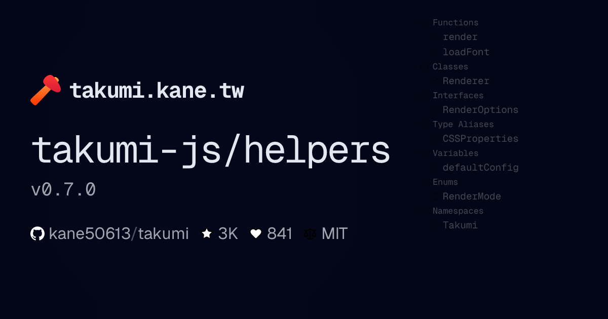
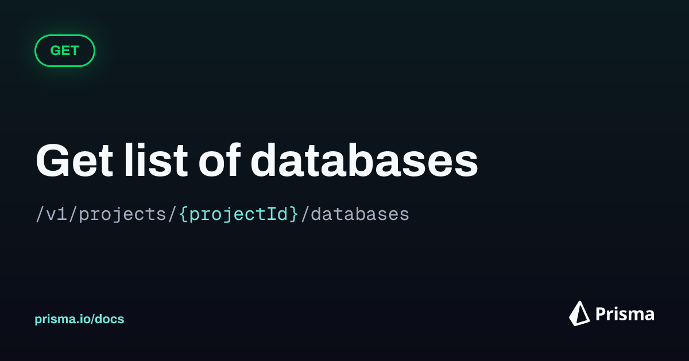
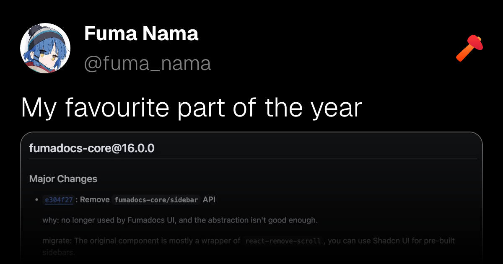
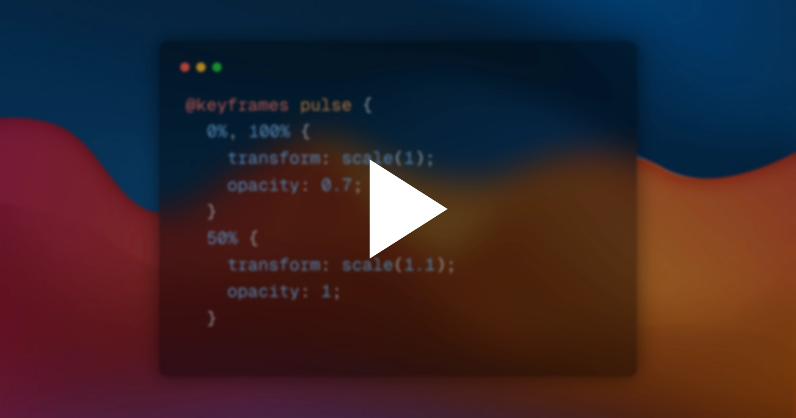

<div align="center">
  

# Takumi

**A Rust rendering engine for turning templates into images, with `next/og`-compatible APIs.**

One engine for Node.js, Edge, browsers, or embed the Rust crate directly.

[Documentation](https://takumi.kane.tw/docs/) · [Playground](https://takumi.kane.tw/playground)

</div>

## Core Concepts

Rather than building a React-specific Satori clone, Takumi aims to be minimal in its core and framework-agnostic.
Any template format that can be converted into Takumi's [node tree](https://takumi.kane.tw/docs/reference) can be rendered. The core node model has three node types: container, image, and text.

Finally Takumi renders that tree to an image.

Besides a pure static image, Takumi also has a time axis, allowing you to render animations & GIFs at specific timestamps for GIFs or video encoding.



## Comparison

Takumi brings a Satori-like developer experience to a unified Rust pipeline without headless browser dependencies.

| Feature             | `next/og` (Satori)  |                        `Takumi`                         |
| :------------------ | :-----------------: | :-----------------------------------------------------: |
| **Runtime**         |      Node/Edge      | Node, Edge, Cloudflare Workers, Browser, **Rust crate** |
| **Styling**         | Tailwind/CSS subset |                 **Tailwind/CSS subset**                 |
| **Template Input**  | JSX/React elements  |     **JSX/React elements**, HTML strings, node tree     |
| **ImageResponse**   |       Native        |          ✅ **Compatible constructor/options**          |
| **Animated Output** |         N/A         |               **WebP / APNG / GIF** APIs                |

## Quick start

### Install

```bash
bun i takumi-js
```

### `render()`

```tsx
import { render } from "takumi-js";
import { writeFile } from "node:fs/promises";

const image = await render(
  <div tw="w-full h-full flex items-center justify-center bg-gradient-to-b from-blue-100 to-red-50">
    <h1 tw="text-6xl font-bold">Hello from Takumi</h1>
  </div>,
  { width: 1200, height: 630 },
);

await writeFile("./output.png", image);
```

### `new ImageResponse()`

```tsx
import { ImageResponse } from "takumi-js/response";

export function GET() {
  return new ImageResponse(
    <div tw="w-full h-full flex items-center justify-center bg-gradient-to-b from-blue-100 to-red-50">
      <h1 tw="text-6xl font-bold">Hello from Takumi</h1>
    </div>,
    { width: 1200, height: 630 },
  );
}
```

## Showcase

|                                 Takumi OG image [(source)](./example/twitter-images/components/og-image.tsx)                                 |                Package OG card [(source)](./example/twitter-images/components/package-og-image.tsx)                 |
| :------------------------------------------------------------------------------------------------------------------------------------------: | :-----------------------------------------------------------------------------------------------------------------: |
|                                                                              |                                            |
|                        **Prisma-style API card** [(source)](./example/twitter-images/components/prisma-og-image.tsx)                         |              **X-style social post** [(source)](./example/twitter-images/components/x-post-image.tsx)               |
|                                                                       |                                              |
|                             **Keyframe Animation** [(source)](./example/ffmpeg-keyframe-animation/src/index.tsx)                             |                                **[shiki-image](https://github.com/pi0/shiki-image)**                                |
| [](./example/ffmpeg-keyframe-animation/output/animation.mp4) |  |

- [(Unofficial) Takumi Playground](https://takumi-playground.kapadiya.net/)

## Contributing

Read [CONTRIBUTING.md](./CONTRIBUTING.md).

## License

MIT or Apache-2.0

<br/>
<a href="https://vercel.com/oss">
  
</a>
