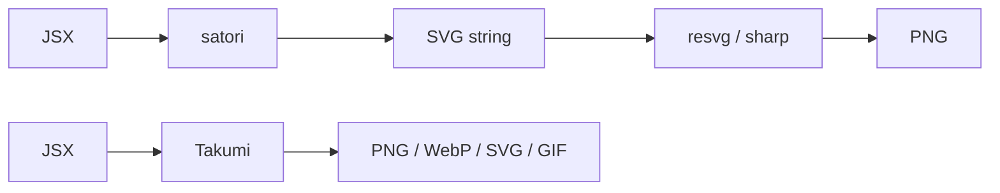

[satori](https://github.com/vercel/satori) pioneered OG images without a headless browser and powers `next/og`. It turns JSX into an SVG string, so a bitmap takes a pipeline: yoga computes layout in WebAssembly, satori emits SVG, and `resvg` or `sharp` rasterizes it. Takumi is one Rust engine that does the whole job: JSX in, encoded image out.



Migration is mostly an import swap: `ImageResponse` matches the `next/og` API, and templates written for satori declare `display: flex` explicitly, so they render unchanged.

Compare rendered output across providers at [image-bench.kane.tw](https://image-bench.kane.tw).

## Features

### Templates and styling

| Feature                             | satori / `next/og`       | Takumi                        |
| :---------------------------------- | :----------------------- | :---------------------------- |
| Template input                      | JSX                      | JSX, HTML strings, node trees |
| Styling                             | Inline styles, `tw` prop | + `<style>` tags, stylesheets |
| Selectors, `::before` / `::after`   | ❌                       | ✅                            |
| `@media`, `@keyframes`, `@supports` | ❌                       | ✅                            |
| `calc()`                            | ❌                       | ✅                            |

Selector support covers class, id, descendant, `:is()`, `::before`, and `::after`. See [Styling](/docs/styling).

### Layout and text

| Feature                        | satori / `next/og`  | Takumi                                  |
| :----------------------------- | :------------------ | :-------------------------------------- |
| Layout modes                   | Flexbox only        | Flexbox, CSS Grid, block, inline, float |
| `z-index`                      | ❌ paint order only | ✅                                      |
| `backdrop-filter`, blend modes | ❌                  | ✅                                      |
| RTL text                       | ❌                  | ✅                                      |

### Output

| Feature                            | satori / `next/og`          | Takumi         |
| :--------------------------------- | :-------------------------- | :------------- |
| Raster (PNG, JPEG, WebP, ICO)      | ❌ needs `resvg` or `sharp` | ✅ direct      |
| Vector SVG                         | ✅                          | ✅ `renderSvg` |
| Animated (GIF, APNG, WebP)         | ❌                          | ✅             |
| Raw pixel frames (video pipelines) | ❌                          | ✅             |

### Fonts, emoji, runtime

| Feature             | satori / `next/og`         | Takumi                           |
| :------------------ | :------------------------- | :------------------------------- |
| Default font        | Geist 400 (`next/og` only) | ✅ Geist 400 to 800              |
| WOFF2               | ❌                         | ✅                               |
| Emoji providers     | `next/og` only             | ✅ built in                      |
| Runtime             | Node, Edge, browser        | + Cloudflare Workers, Rust crate |
| `ImageResponse` API | ✅ Native                  | ✅ Compatible                    |

## Layout defaults

satori forces `display: flex` on every element and throws when a `<div>` holds multiple children without an explicit `display`. Takumi follows CSS: a bare `<div>` is `display: block`. Explicit `display: flex` in a satori template carries over unchanged, so this difference only shows up in new templates.

## Migrate from satori

`renderSvg` replaces `satori()`. Same input shape, same SVG-string output, and no `fonts` requirement for Latin text.

```tsx
import satori from "satori"; // [!code --]
import { renderSvg } from "takumi-js"; // [!code ++]

const svg = await satori(<div style={{ display: "flex" }}>Hello</div>, { // [!code --]
const svg = await renderSvg(<div style={{ display: "flex" }}>Hello</div>, { // [!code ++]
  width: 1200,
  height: 630,
  fonts: [{ name: "Inter", data: interBytes, weight: 400, style: "normal" }], // [!code --]
});
```

Skip the SVG step entirely when the goal is a bitmap. satori pipelines pair with `resvg` or `sharp` to rasterize; `render` returns encoded bytes in one call.

```tsx twoslash
import { render } from "takumi-js";

const png = await render(<div tw="w-full h-full flex items-center justify-center">Hello</div>, {
  width: 1200,
  height: 630,
});
```

## Migrate from `next/og`

[`ImageResponse`](/docs/image-response) matches the `next/og` API, including the satori-compatible `emoji` option. Swap the import.

```tsx
import { ImageResponse } from "next/og"; // [!code --]
import { ImageResponse } from "takumi-js/response"; // [!code ++]

export function GET() {
  return new ImageResponse(<div tw="w-full h-full flex items-center justify-center">Hello</div>, {
    width: 1200,
    height: 630,
  });
}
```

The [Next.js integration guide](/docs/integration/nextjs) covers `opengraph-image.tsx` and route handlers.

## Fonts

satori throws without at least one `fonts` entry. Takumi ships a built-in last-resort font (Geist, Latin only, weights 400 to 800), so Latin text renders with zero setup. For anything else, [`googleFonts`](/docs/helpers#fonts) fetches families in one call, and `fonts` also accepts raw bytes, descriptors, or bare URL strings.

```tsx twoslash
import { render } from "takumi-js";
import { googleFonts } from "takumi-js/helpers";

const png = await render(
  <div style={{ fontFamily: "Noto Sans TC" }} tw="w-full h-full flex text-7xl">
    你好，匠
  </div>,
  {
    width: 1200,
    height: 630,
    fonts: googleFonts([{ name: "Noto Sans TC", weight: 700 }]),
  },
);
```

See [Fonts](/docs/typography-and-fonts) for script routing and preloading with `Renderer`.

## Emoji

`next/og` resolves emoji through satori's `loadAdditionalAsset` callback. Takumi's `ImageResponse` accepts the same `emoji` option: `twemoji`, `blobmoji`, `noto`, `openmoji`, `fluent`, and `fluentFlat`. See [Load images](/docs/load-images#emoji).

## Animation

satori renders one static frame. Takumi threads a time axis through the pipeline: CSS `@keyframes`, the `animation` shorthand, and Tailwind animation utilities resolve at render time, and [`renderAnimation`](/docs/keyframe-animation) samples the same tree across timestamps into GIF, APNG, or animated WebP.

## Performance and memory

satori runs layout and text shaping in JavaScript on the calling thread. It hands the SVG string to a separate rasterizer. Takumi's native binding moves the whole pipeline off the event loop:

- **Renders run on worker threads.** `render` executes as an async task, so the event loop stays free, and concurrent renders read the font store without locking.
- **Animation frames render in parallel** across a thread pool and stream into the encoder, so memory stays flat as frame count grows.
- **Images decode at draw size.** A large photo drawn in a small box retains pixels at the draw size, not the source size, and the decode cache reuses them across renders.
- **Fonts download by coverage.** `googleFonts` splits each family into unicode-range subsets, and a render fetches only the subsets its codepoints hit.

See [Performance and optimization](/docs/performance-and-optimization) for tuning.

## Tradeoffs

Measured from a clean `npm install` (macOS arm64) and gzip of the published artifacts, `takumi-js` 2.2.0 against satori 0.26 and `@vercel/og` 0.11:

| Package                    | Install size (`node_modules`)     | Edge bundle (gzip)                       |
| :------------------------- | :-------------------------------- | :--------------------------------------- |
| satori + `@resvg/resvg-js` | 14 MB                             | —                                        |
| `@vercel/og`               | 35 MB (16 MB is optional `sharp`) | ~0.7 MB (`index.edge.js` + `resvg.wasm`) |
| `takumi-js`                | 8.6 MB                            | 1.5 MB (`takumi_wasm_bg.wasm`)           |

The WebAssembly binary is the weak spot: **3.7 MB raw, 1.5 MB gzipped**, about twice the `@vercel/og` edge stack. Cold starts download and compile more, and it takes a bigger bite out of platform script-size limits. On Node the picture flips: one native binary replaces satori, yoga, opentype.js, and resvg.

## Used in production

[Dcard](https://dcard.tw), [TanStack](https://tanstack.com), [Fumadocs](https://fumadocs.dev), and [Luma](https://lu.ma) render share images with Takumi, and [Nuxt OG Image](https://nuxtseo.com/docs/og-image/renderers/takumi) ships it as a built-in renderer. More in the [showcase](https://takumi.kane.tw/showcase).
