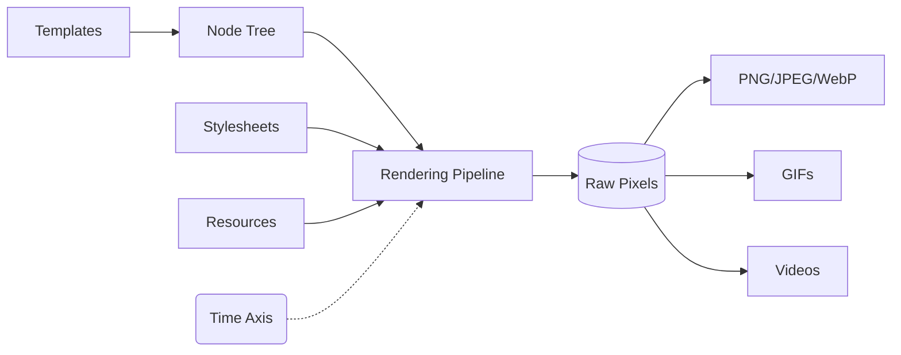

Takumi is a image renderer written in Rust, with bindings for Node.js and Browser.
It allows you to render templates to images, with support for custom fonts, dynamic data, and more.

This documentation covers the usage and features for JavaScript bindings. If you're looking for the low-level Rust APIs, check out the [Rust crate docs](https://docs.rs/takumi) instead.

<Cards>
  <Card
    title="Playground"
    href="https://takumi.kane.tw/playground"
    description="Try Takumi in your browser"
    icon={<Shovel />}
  />
  <Card
    title="Integration"
    href="/docs/integration"
    description="How to use Takumi in your projects"
    icon={<ToyBrick />}
  />
</Cards>

## Core Concepts

Rather than building a React-specific Satori clone, Takumi aims to be minimal in its core and framework-agnostic.
Any template format (React JSX, raw HTML, JSON, Svelte, Vue, etc.) can be transformed into a unified [node tree](/docs/reference) that contains three types of nodes: container, image and text.

Finally Takumi renders that tree to an image.

Besides a pure static image, Takumi also has a time axis, allowing you to render animations & GIFs at specific timestamps for GIFs or video encoding.

## Features

### Advanced Layout

Powered by Taffy for high-performance Flexbox, CSS Grid, and block layouts. It supports absolute positioning, z-index stacking, inline text spans, and nested inline blocks.

### Typography

Browser-grade text shaping and layout. Supports WOFF/WOFF2 fonts, emoji, and RTL languages out of the box.

### Animations

Parses CSS `@keyframes` and the `animation` shorthand property. Render animations and videos frame-by-frame with support for percentage offsets, timing functions (`linear`, `ease`, `steps`, custom `cubic-bezier`), delays, fill modes, and iteration counts. Includes built-in Tailwind presets like `spin`, `ping`, `pulse`, and `bounce`.

### Styling

CSS stylesheet parsing and Tailwind v4 support. Handles arbitrary values, linear and radial gradients, box shadows, blend modes, transforms, filters, and complex CSS selectors.

### Flexible Runtime

Deploy anywhere. Ships with optimized native bindings for Node.js (via N-API), WebAssembly for Edge environments (Cloudflare Workers, browsers), or embed the native Rust crate directly.
