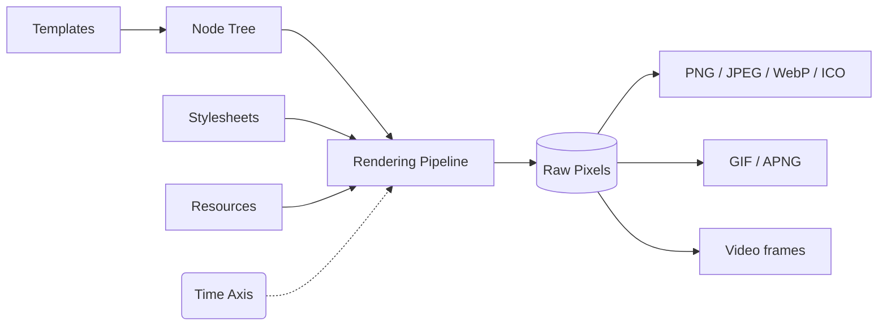

Most image-generation solutions are either a headless Chromium instance eating 300 MB of RAM, or a minimal SVG-to-PNG renderer that falls apart the moment you need real CSS. Takumi is neither.

It's a purpose-built Rust pipeline — CSS parsing, layout, compositing, image output — that runs the same in a serverless edge function, a Node.js server, a browser, or directly as a Rust crate. Reach for headless Chrome when you need full DOM and JavaScript fidelity. Reach for Satori when minimal layout is enough. Reach for Takumi when you want real CSS without a browser.

<Cards>
  <Card
    title="Quickstart"
    href="/docs/quickstart"
    description="Render your first image in under five minutes"
    icon={<Shovel />}
  />
  <Card
    title="Frameworks"
    href="/docs/frameworks"
    description="Wire Takumi into Next.js, Cloudflare Workers, SvelteKit, and more"
    icon={<ToyBrick />}
  />
  <Card
    title="Playground"
    href="https://takumi.kane.tw/playground"
    description="Try Takumi in your browser without setup"
    icon={<Hand />}
  />
</Cards>
