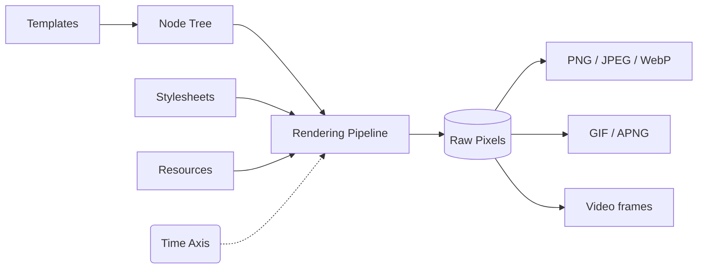

Takumi renders JSX, raw HTML, and structured node trees through a full CSS layout and compositing pipeline, then outputs PNG, JPEG, WebP, GIF, APNG, or raw video frames.

This documentation covers the JavaScript bindings (`takumi-js`). For the low-level Rust API, see the [crate docs on docs.rs](https://docs.rs/takumi).

<Cards>
  <Card
    title="Playground"
    href="https://takumi.kane.tw/playground"
    description="Try Takumi in your browser without any setup"
    icon={<Shovel />}
  />
  <Card
    title="Integration"
    href="/docs/integration"
    description="Add Takumi to Next.js, Cloudflare Workers, or any JS runtime"
    icon={<ToyBrick />}
  />
</Cards>

## How It Works

Most image-generation solutions are either a headless Chromium instance eating 300 MB of RAM, or a minimal SVG-to-PNG renderer that falls apart the moment you need real CSS. Takumi is neither of those.

It converts any template into a **node tree** with three node kinds: `container`, `image`, and `text`. That tree runs through:

1. **Layout** via [taffy](https://github.com/DioxusLabs/taffy): Flexbox, Grid, block, float, `calc()`, absolute positioning, z-index
2. **Text shaping** via [parley](https://github.com/linebender/parley) and [skrifa](https://github.com/googlefonts/fontations/tree/main/skrifa): WOFF/WOFF2 fonts, emoji, RTL, multi-span inline blocks
3. **Compositing**: stacking contexts, blend modes, filters, transforms, SVG via [resvg](https://github.com/linebender/resvg)
4. **Output**: PNG, JPEG, WebP for statics; GIF, APNG, WebP for animations; raw RGBA frames for video pipelines

A **time axis** threads through the pipeline. Animations, GIFs, and video frames are not a separate API. They're the same renderer called at timestamp `t`.

## Features

### Advanced Layout

Full **Flexbox, CSS Grid, block, and float** layout engine via [taffy](https://github.com/DioxusLabs/taffy). Supports `calc()`, absolute positioning, z-index stacking, inline text spans, and nested inline blocks.

### Typography

Browser-grade text shaping and rendering via [parley](https://github.com/linebender/parley), with glyph loading from [skrifa](https://github.com/googlefonts/fontations/tree/main/skrifa). Native support for WOFF and WOFF2 fonts, emoji, RTL languages, and multi-span inline blocks.

### CSS & Tailwind

A full-featured stylesheet engine: complex selectors, CSS variables, shorthand properties, arbitrary values, `@keyframes`, linear/radial gradients, `box-shadow`, `filter`, `backdrop-filter`, `mix-blend-mode`, and `transform`. Tailwind v4 is supported out of the box.

### Animations

Parse CSS `@keyframes` and the `animation` shorthand property. Render frame-by-frame with support for percentage, `from`, and `to` offsets; `linear`, `ease`, `steps()`, and `cubic-bezier()` timing functions; fill modes, delays, and iteration counts. Built-in Tailwind presets like `spin`, `ping`, `pulse`, and `bounce` work automatically.

### SVG

Full SVG parsing and rasterization via [resvg](https://github.com/linebender/resvg). Use inline SVG or reference external files.

### Flexible Runtime

Takumi runs everywhere without changing your code:

| Target                           | Details                                            |
| :------------------------------- | :------------------------------------------------- |
| **Node.js**                      | Native N-API binary with Rayon multithreading      |
| **Cloudflare Workers / Browser** | WebAssembly with SIMD optimization                 |
| **Rust crate**                   | Embed `takumi` directly. Zero JS runtime required. |
