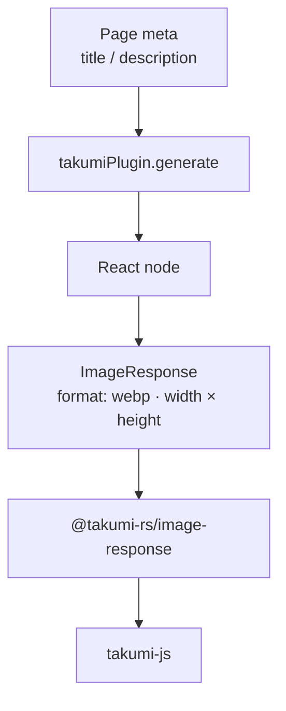

[Fumapress](https://press.fumadocs.dev) is a docs framework on Waku. The plugin is **included in `fumapress`**. See the [Fumapress Takumi docs](https://press.fumadocs.dev/docs/plugins/takumi) for the upstream reference.

It renders an image for every docs page through Takumi and injects the matching meta tags.

## Enable the plugin

```tsx title="press.config.tsx"
import { defineConfig } from "fumapress";
// [!code ++]
import { takumiPlugin } from "fumapress/plugins/takumi";

export default defineConfig({
  // ...
})
  // [!code ++]
  .plugins(takumiPlugin());
```

With no options, the plugin:

- Builds a WebP per page (default layout from `fumadocs-ui/og/takumi`: title, description, site name)
- Injects Open Graph and Twitter meta on each page

```html
<meta property="og:image" content="/docs/page.webp" />
<meta property="og:image:width" content="1200" />
<meta property="og:image:height" content="630" />
<meta property="twitter:card" content="summary_large_image" />
```

<Callout type="warn">
  Set `site.baseUrl` so `og:image` is an absolute URL. Relative paths break most crawlers.

```tsx title="press.config.tsx"
import { defineConfig } from "fumapress";

export default defineConfig({
  site: {
    // [!code ++]
    baseUrl: "https://example.com",
  },
});
```

</Callout>

## Customize the image

Pass `generate`. It runs as a method on the app context (`this.siteConfig`, loaders, and the rest of the Fumapress context).

Return:

| Field     | Type                            | Role                 |
| --------- | ------------------------------- | -------------------- |
| `node`    | `ReactNode`                     | Layout Takumi paints |
| `options` | `Partial<ImageResponseOptions>` | Forwarded to Takumi  |

For the stock card layout instead of custom JSX, import `generate` from `fumadocs-ui/og/takumi` (what the plugin uses by default):

```tsx title="press.config.tsx"
// [!code ++]
import { generate as generateOgNode } from "fumadocs-ui/og/takumi";
import { takumiPlugin } from "fumapress/plugins/takumi";
// [!code ++]
import { googleFonts } from "takumi-js/helpers";

takumiPlugin({
  generate(page) {
    return {
      // [!code ++:5]
      node: generateOgNode({
        title: page.data.title,
        description: page.data.description,
        site: this.siteConfig.name,
      }),
      options: {
        // [!code ++]
        fonts: googleFonts([{ name: "Noto Serif", weight: [600, 800] }]),
      },
    };
  },
});
```

## Options

From `TakumiOptions` in `fumapress/plugins/takumi`:

| Option     | Default                              | Notes                                                     |
| ---------- | ------------------------------------ | --------------------------------------------------------- |
| `generate` | `fumadocs-ui/og/takumi` default card | `(page) => { node, options? }`; `this` is the app context |
| `width`    | `1200`                               | Image width; written into `og:image:width`                |
| `height`   | `630`                                | Image height; written into `og:image:height`              |
| `basePath` | `/` (static) or `/_takumi` (dynamic) | Route prefix for image URLs                               |

### Paths

Image paths follow page slugs: a page at `/docs/styling` maps to `/docs/styling.webp` under `basePath`. The section index uses `index.webp`. With i18n, the locale segment is prepended.

### Render mode and `basePath`

| App mode           | Default `basePath` |
| ------------------ | ------------------ |
| Static (`default`) | `/`                |
| Dynamic            | `/_takumi`         |

```tsx title="press.config.tsx"
takumiPlugin({
  // [!code ++]
  basePath: "/og",
  width: 1200,
  height: 630,
});
```

## Fonts

Takumi never reads system fonts. Load families through `options.fonts` on the image response, or uncovered glyphs become tofu after the built-in Latin fallback.

See [Typography & Fonts](/docs/typography-and-fonts).

## How it wires to Takumi



`fumapress` already depends on `takumi-js`. A normal Fumapress install already pulls the renderer, and you do not install a separate OG package for the default setup.

For the full plugin reference, use the [Fumapress Takumi page](https://press.fumadocs.dev/docs/plugins/takumi).
