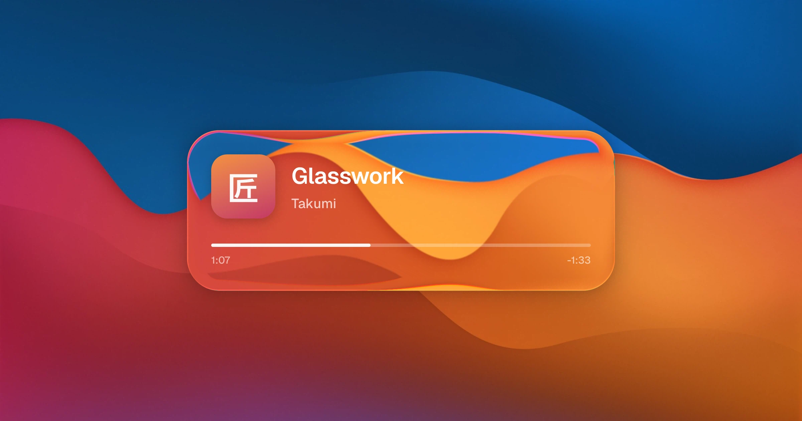

# liquid-glass

Renders a scene with Takumi as raw RGBA pixels, runs an Apple-style liquid glass
shader over it with WebGPU (WGSL, via Dawn), then feeds the pixels back into
Takumi as a raw image source to compose the final image.

The shader is a WGSL port of the physically-based pipeline in
[whynotmake-it/flutter_liquid_glass](https://github.com/whynotmake-it/flutter_liquid_glass):
a circular-arc height profile over a squircle SDF, Snell refraction through the
surface normal, chromatic aberration, and background-tinted rim lighting.



```sh
node src/index.ts        # WebGPU shader
node src/index.ts --cpu  # same math in pure TypeScript, no GPU
```

The CPU port (`src/liquid-glass-cpu.ts`) produces output within 2/255 of the
GPU pass, in about 300ms for a 2400x1260 frame.

Output lands in `output/liquid-glass.webp`. Requires Node with WebGPU prebuilds
available (the `webgpu` npm package ships Dawn binaries for common platforms).
